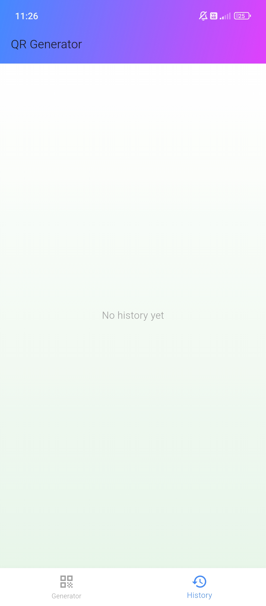
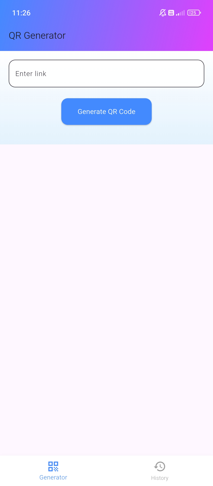

# QR Code Generator APK

**Version:** 1.0.0

A simple, modern Android app that generates a QR code from any URL.

---

## Table of Contents

- [Description](#description)
- [Installation](#installation)
- [Usage](#usage)
- [Features](#features)
- [Screenshots](#screenshots)
- [Upcoming Features](#upcoming-features)
- [License](#license)

---

## Support This Project

[Buy Me a Coffee](https://buymeacoffee.com/harishdevlab)  
[Support via UPI](https://drive.google.com/file/d/153n7zxHg-srjOmtZEUESpnN_FlQbBKko/view?usp=sharing)

---

## Description

This Android app lets you enter any valid URL and instantly generates a QR code for it. Lightweight, fast, and completely offline.

---

## Installation

1. Download the APK file to your Android device.
2. Go to **Settings > Security > Unknown Sources**, and enable it.
3. Open the APK and install the app.
4. Launch the app from your app drawer.

---

## Usage

1. Open the app.
2. Paste or type a link in the input field.
3. Tap on **Generate QR Code**.
4. The QR code will be displayed instantly.

---

## Features

**Version 1.0.0**
- Convert any URL into a QR code
- Works completely offline
- Clean, responsive UI
- Keeps a history of generated links

---

## upcoming-features

**Version 2.0.0 (Planned)**
- Add **Save as PNG** feature (download QR code to device)
- Option to customize QR color and size

---

## Screenshots

Below are previews from version 1.0.0:

---

## License

This project is licensed under the Creative Commons Attribution-NonCommercial-NoDerivatives 4.0 International License.  
See the [LICENSE](./LICENSE) file or visit [https://creativecommons.org/licenses/by-nc-nd/4.0/](https://creativecommons.org/licenses/by-nc-nd/4.0/).
